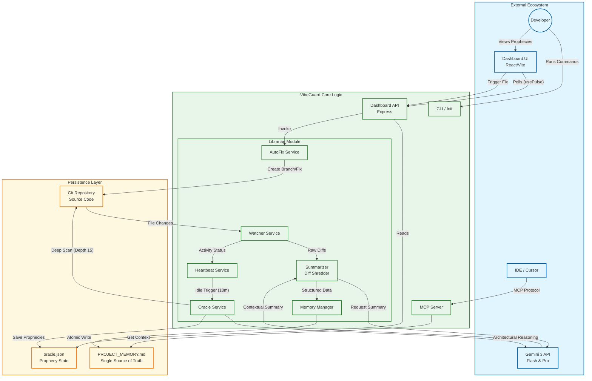

# VibeGuard Architecture Diagram

# Legend

*   **External Ecosystem (Blue):** Components outside the core Node.js runtime, including the Developer, AI Models, IDEs, and the React Frontend.
*   **VibeGuard Core Logic (Green):** The internal TypeScript services running via Node.js/tsx, handling the business logic, file watching, and API orchestration.
*   **Persistence Layer (Amber):** The file system elements where state is stored, including the Git repository, the generated memory file, and JSON state stores.
*   **Arrows:** Indicate the direction of data flow or control triggers (e.g., "Atomic Write", "Deep Scan").