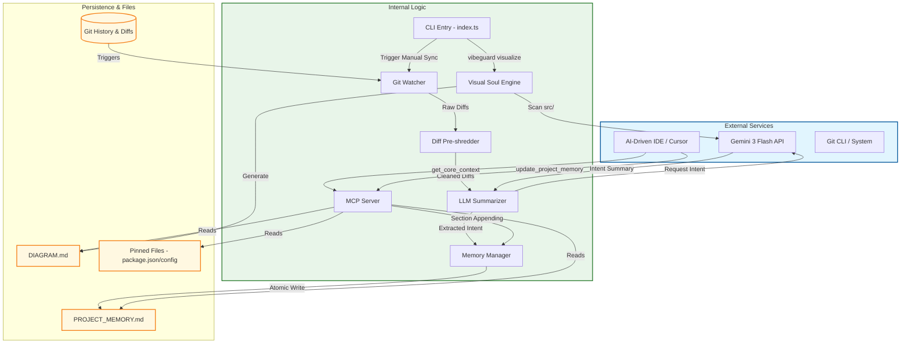

# VibeGuard Architecture Diagram

## Legend

| Symbol | Meaning | Color |
| :--- | :--- | :--- |
| **Blue Box** | **External Services** | Third-party APIs, IDEs, and system-level tools (Gemini, Git). |
| **Green Box** | **Internal Logic** | Core VibeGuard TypeScript components and processing pipeline. |
| **Amber Box** | **Persistence & Files** | Data storage layer, including the Single Source of Truth and configuration. |
| **Solid Arrow** | **Data Flow** | Direction of information transfer or tool invocation. |
| **Cylinder** | **Database/History** | Represents versioned state or historical data (Git). |