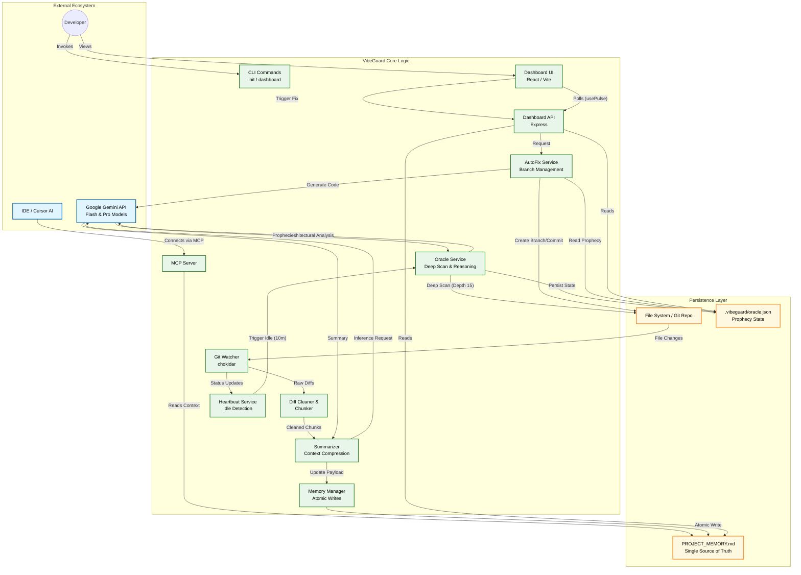

# VibeGuard Architecture Diagram

# Legend

| Symbol / Color | Meaning |
| :--- | :--- |
| **Blue Node** | **External Services** (APIs, IDEs, Users) |
| **Green Node** | **Internal Logic** (VibeGuard Services, Librarian Modules, Dashboard) |
| **Amber Node** | **Persistence Files** (Storage, Memory, Configs) |
| **Solid Arrow** | Direct data flow or function call |
| **Subgraph** | Logical grouping of components |